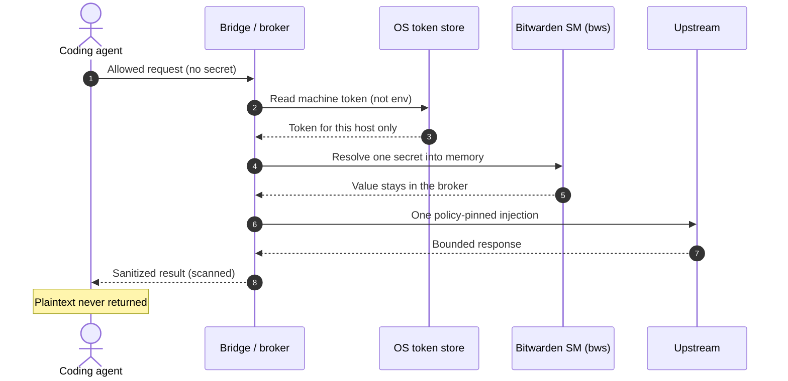

<p align="center">
  <a href="README.md">English</a>
  &nbsp;·&nbsp;
  <a href="README.de.md">Deutsch</a>
</p>

<p align="center">
  
</p>

<h1 align="center">Agent Credential Bridge</h1>

<p align="center"><strong>Give an AI agent the <em>use</em> of a secret — never the secret itself.</strong></p>

<p align="center">
  Agents are extraordinary at using tools and terrible at keeping secrets.<br>
  So this broker injects credentials at the outbound boundary, not into the model.
</p>

<p align="center">
  <a href="https://github.com/ShredFred/bitwarden-agent-credential-bridge/releases"></a>
  <a href="LICENSE"></a>
  <a href="https://github.com/ShredFred/bitwarden-agent-credential-bridge/actions/workflows/ci.yml"></a>
  
</p>

<p align="center"><strong>Built with</strong></p>

<p align="center">
  
  
  
  
  
  
</p>

<p align="center">
  <em>Resolves from <strong>your</strong> Secrets Manager machine account. Not a Bitwarden product.</em>
</p>

<p align="center">
  <a href="#how-it-works">How it works</a> ·
  <a href="#install-on-windows">Windows</a> ·
  <a href="#install-on-macos">macOS</a> ·
  <a href="#install-on-linux">Linux</a> ·
  <a href="docs/manifesto.md">Manifesto</a> ·
  <a href="#faq">FAQ</a> ·
  <a href="#for-agents">For agents</a>
</p>

---

## What this is

A fail-closed credential broker for coding agents. The agent asks to call an
allowed API, log into a form, or run a pinned SSH/FTP op. The Bridge injects
the credential at the outbound boundary. Passwords, tokens, cookies, and
session material stay in Bridge memory. If they leak onto an agent-readable
surface, tests fail.

The operator pastes a Bitwarden Secrets Manager **machine token** once, into a
local setup window. After that, agents work. Secrets do not.

| The agent may | The agent never gets |
| --- | --- |
| Call a policy-pinned HTTP route | The bearer token, API key, or Basic password |
| Pick login fields by **index** | CSS/XPath, cookies, CDP, or the password value |
| Replay an opaque session on allow-listed paths | `Set-Cookie`, storage state, or `eval` |
| Exec a pinned SSH/FTP op on loopback | Process-environment injection (`env_inject`) |

## How it works

Bitwarden's [Agent Access SDK](https://github.com/bitwarden/agent-access) is an
open protocol for a **remote** client to request a vault item through an
encrypted tunnel, with a local `aac` listener and optional `aac run` into a
child **environment**. This Bridge is a different shape of the same idea: a
**local coding agent** must not see the secret, so injection happens on the
wire (or in a session broker), never in `process.env`, and never in the model
context.

<p align="center">
  
</p>



| Agent Access SDK | This Bridge |
| --- | --- |
| Noise tunnel + pairing token | Same-user broker + SM machine token in DPAPI / Keychain / `0600` |
| `aac listen` / `aac connect` | Operator CLI + allow-listed policies |
| Often `bw` password-manager items | Secrets Manager machine account (`bws`) |
| `aac run` may inject `AAC_*` env | **`env_inject` is permanently rejected** |
| Client may receive username/password JSON | Agent never receives plaintext |
| Provider holds vault access | OS helper research stays **vault-free** |

Full mapping: [How it works](docs/how-it-works.md).
Agent Access source: [bitwarden/agent-access](https://github.com/bitwarden/agent-access).
This repository does not ship that SDK and does not claim protocol compatibility.

## The manifesto

Agents get **use**, not possession. Policies are allow-lists. Unsupported
classes fail closed. Secrets never ride the process environment.
`authorization_ready` is evidence, not a slogan. The helper stays vault-free.
Limits are named in public.

Read it: [Agent Credential Manifesto](docs/manifesto.md).

## What you get

### Productive same-user path (Windows, macOS, and Linux)

- **Windows:** GitHub Release installer with Start Menu setup, start, and
  Apps & Features uninstall. Token in DPAPI.
- **macOS:** from-source wizard (`npm run setup:sm:wizard`). Token in the
  same-user Keychain. Signed `.pkg` remains a later slice.
- **Linux:** from-source wizard (`npm run setup:sm:wizard`, zenity/kdialog or
  a hidden TTY prompt). Token in an owner-only `0600` file under XDG config.
  Distro packages remain a later slice.
- **Bitwarden Secrets Manager** as the default vault: machine account, project
  allowlist. Cloud by default; optional self-host URLs.
- **No extra OS user** and **no LocalService / LaunchDaemon / systemd helper
  required** for day-to-day SM resolve. Distinct-writer install remains
  optional research.
- Guided import of local DPAPI / `.env` material into SM (Windows; dry-run
  default). macOS and Linux consume the same SM projects after a machine-account
  grant.

### Credential classes that actually run

| Class | What the Bridge does |
| --- | --- |
| HTTP bearer / API-key header / Basic / query | Injects exactly one outbound credential; strips caller forgeries |
| Browser form-login | Logs in from memory; agent sees an opaque session, not the cookie |
| Bridge-owned browser | Agent is the *eyes* (field indices, plus screenshots except during password fill). Bridge is the *hands* for secrets. Optional in-process Playwright adapter (not a package dependency; headless default). Never agent CDP |
| SSH / FTP (loopback) | Dedicated session brokers, allow-listed ops, no `env_inject` |

Unsupported on purpose, and they fail closed: OAuth, interactive MFA, SMS,
email codes, and process-environment injection.

### Security posture you can show a reviewer

- Policies are **allow-lists**, not template languages. Placeholders only —
  never values.
- Every runtime secret is scanned in raw, percent, form, Base64, and Base64url
  forms across responses, logs, and errors.
- One writer at a time. MFA/CAPTCHA terminate with value-free codes, not HTML.
- `authorization_ready` is evidence-driven. Unlocking SM does **not** set it
  true. The helper process stays vault-free.

## Install on Windows

1. Install [Node.js 20+](https://nodejs.org/) and the
   [Bitwarden Secrets Manager CLI (`bws`)](https://bitwarden.com/help/secrets-manager-cli/).
2. In Bitwarden SM: create a **machine account**, grant your projects, create an
   access token. Do not paste it into chat.
3. Download `BitwardenAgentCredentialBridge-Setup-*.exe` from GitHub Releases
   when a release exists, or clone this repo and run `npm run setup:sm:wizard`.
4. Start Menu → **Bitwarden Agent Bridge Setup** → paste the token locally.
5. Seed bindings, then start:

```powershell
npm run seed:sm -- --i-approve-secrets-manager-machine-write --prune --smoke --i-approve-secrets-manager-machine-resolve
npm run start:operational:sm -- --i-approve-secrets-manager-machine-resolve
```

Human walkthrough: [Windows laptop onboarding](docs/windows-laptop-onboarding.md) ·
[SM onboarding and import](docs/sm-onboarding-and-import.md)

Uninstall via **Apps & Features**, or `npm run uninstall:sm -- --i-approve-sm-machine-uninstall`.

Do **not** run `seed:sm --prune` against projects that already hold real keys
unless you intend to replace sample bindings. A second host only needs its own
machine account and project access.

## Install on macOS

1. Install [Node.js 20+](https://nodejs.org/) and the
   [Bitwarden Secrets Manager CLI (`bws`)](https://bitwarden.com/help/secrets-manager-cli/)
   (`~/.local/bin/bws`, `/opt/homebrew/bin/bws`, `/usr/local/bin/bws`, or PATH).
2. In Bitwarden SM: create a **machine account for this Mac**, grant the same
   projects this machine should resolve, create an access token. Do not paste
   it into chat. Do not reuse another host's machine token.
3. From a clone of this repo:

```bash
npm run setup:sm:wizard
npm run start:operational:sm -- --i-approve-secrets-manager-machine-resolve
```

Human walkthrough: [macOS laptop onboarding](docs/macos-laptop-onboarding.md) ·
[SM onboarding and import](docs/sm-onboarding-and-import.md)

Uninstall: `npm run uninstall:sm -- --i-approve-sm-machine-uninstall` (clears
allowlist + Keychain item). Revoke the machine token in Bitwarden SM if the
Mac should lose access.

A signed `.pkg` installer is a later slice.

## Install on Linux

1. Install [Node.js 20+](https://nodejs.org/) and the
   [Bitwarden Secrets Manager CLI (`bws`)](https://bitwarden.com/help/secrets-manager-cli/)
   (`~/.local/bin/bws`, `/usr/local/bin/bws`, `/usr/bin/bws`, or PATH).
2. In Bitwarden SM: create a **machine account for this host**, grant the
   projects this machine should resolve, create an access token. Do not paste
   it into chat. Do not reuse another host's machine token.
3. From a clone of this repo:

```bash
npm ci
npm run install:user-path
npm run setup:sm:wizard
npm run start:operational:sm -- --i-approve-secrets-manager-machine-resolve
```

Human walkthrough: [Linux laptop onboarding](docs/linux-laptop-onboarding.md) ·
[SM onboarding and import](docs/sm-onboarding-and-import.md)

Uninstall: `npm run uninstall:sm -- --i-approve-sm-machine-uninstall` (clears
allowlist + owner-only token file). Revoke the machine token in Bitwarden SM
if the host should lose access.

A `.deb` / `.rpm` package is a later slice.

## For agents

If you are an AI agent pointed at this repo, start here — not at the research
phase list:

1. [Install on Windows (agent runbook)](docs/agent-windows-install.md),
   [Install on macOS (agent runbook)](docs/agent-macos-install.md), or
   [Install on Linux (agent runbook)](docs/agent-linux-install.md)
2. [SM onboarding and import](docs/sm-onboarding-and-import.md)
3. [Experiment rules](AGENTS.md)
4. [Bridge-owned browser contract](docs/phase17-bridge-owned-browser.md)
   (`npm run start:browser:sm`)

Never echo tokens. Never set `BWS_ACCESS_TOKEN` in the user environment.
Never claim `authorization_ready=true` from SM setup alone. Missing `bws` is
`bws_missing`, not an authorization failure.

## Honest limits

- **Experimental.** Contracts are real; production isolation is not claimed.
- **Not affiliated with Bitwarden.** You bring your own SM machine account.
- **Loopback-first.** Public sites need a later explicit live gate. Agent
  Playwright-CLI, Chrome extensions, and agent CDP are not the secret path.
- **No cookie export.** If a task needs the cookie, use an HTTP broker or stop.
- **No screenshots during password fill.** `GET /screenshot` is allowed before
  and after login as raw `image/png` (not JSON). `inject_login` and occupied
  password fields return `password_entry_active`. The `fetch` driver cannot
  screenshot.
- **No MFA solving.** Challenge pages fail closed.
- Platform writer isolation (Windows LocalService, macOS LaunchDaemon, Linux
  systemd) is a documented research ladder, not a prerequisite for SM resolve.

Full capability map: [Features](docs/features.md).
Phase-by-phase research index: [Research status](docs/research-status.md).

## Requirements

- Node.js 20+ (default tests are standard-library only — no npm runtime
  dependencies). Playwright is optional and **not** a package dependency:
  the repo ships a small page adapter, not a browser. Default driver is
  `fetch`. Install Playwright yourself only if you want `--driver playwright`.

```bash
npm test
node src/run-demo.js
```

`run-demo.js` generates a fake sentinel, drives the loopback broker, and exits
non-zero if that sentinel appears on any agent-readable surface.

## FAQ

**What is Agent Credential Bridge?**
A local, fail-closed broker so coding agents can call allow-listed HTTP,
browser, and loopback session ops using Bitwarden Secrets Manager — without
the plaintext secret entering the agent context.

**Is this the Bitwarden Agent Access SDK?**
No. [Agent Access](https://github.com/bitwarden/agent-access) is Bitwarden's
open protocol, CLI, and SDK (Noise tunnel, pairing, optional env injection via
`aac run`). This project is an independent research harness with a different
injection boundary. See [How it works](docs/how-it-works.md).

**Does unlocking Secrets Manager make `authorization_ready` true?**
No. That flag is compiled from branded platform evidence. SM unlock is not
writer isolation.

**Where does the machine token live?**
Windows DPAPI, macOS Keychain, or a Linux owner-only `0600` file under XDG
config. Never in git, chat, or agent `process.env`.

**Can the agent get the cookie / password / CDP endpoint?**
No. Those surfaces fail closed (`session_material_forbidden`,
`command_forbidden`, `password_entry_active`).

**Is this production-ready isolation?**
No. It is experimental. Same-user process memory is not a distinct-writer
boundary. The OS helper ladders are research, optional, and vault-free.

**How do I report a security issue?**
Private vulnerability reporting only:
[Security advisories](https://github.com/ShredFred/bitwarden-agent-credential-bridge/security/advisories/new).
Do not open a public issue for a suspected leak.

## Disclaimer

**This is experimental research software, not a hosted service and not a
Bitwarden product.** By using it you acknowledge:

1. **You control the vault.** Secrets Manager projects, machine accounts, and
   tokens are yours. This repository never receives them.
2. **You control the agent.** The Bridge aims to keep secrets off agent-readable
   surfaces; models and CLIs can still behave unexpectedly. Do not paste tokens
   into chat "to help debug."
3. **No endorsement.** Bitwarden, Agent Access, and OneCLI names appear as
   factual references only. See [Trademark](docs/trademark.md).
4. **No warranty.** Apache-2.0, as-is. Contracts in tests are real; production
   isolation is not claimed. The authors are not liable for leaked secrets,
   failed jobs, or account actions at third parties.

Publication review: [publication-review.md](docs/publication-review.md).

## About the author

I'm [Frederik Stadler](https://www.linkedin.com/in/frederikstadler) (GitHub
[ShredFred](https://github.com/ShredFred)), based in Berlin. I work on
operations, systems, and automation. I built this so coding agents can use
Secrets Manager on a laptop without eating the vault — the contract I wanted
after watching tokens show up in logs, transcripts, and tool traces.

This is a personal open-source research harness. It is not an official product
of any employer.

## Contributing

- **Issues** — reproducible bugs and bounded work.
- **Discussions** — architecture and early ideas.
- **Pull requests** — tested, narrow, with a security-boundary note.
- **Private vulnerability reporting only** for suspected security issues.

See [CONTRIBUTING.md](CONTRIBUTING.md), [CODE_OF_CONDUCT.md](CODE_OF_CONDUCT.md),
[SUPPORT.md](SUPPORT.md), and [Architecture](docs/architecture.md).

## License and trademark

The code is [Apache-2.0](LICENSE). This aligns with upstream Bitwarden Agent
Access / OneCLI licensing for research references only. This repository does
not ship their source, claim compatibility, or imply endorsement.

Names and marks: [Trademark](docs/trademark.md) ·
[Licensing](docs/licensing.md).

## Let's connect

[](https://github.com/ShredFred/bitwarden-agent-credential-bridge)
[](https://www.linkedin.com/in/frederikstadler)
[](https://github.com/ShredFred/bitwarden-agent-credential-bridge/discussions)
[](mailto:frederikstadler+bridge@gmail.com)

Support maintenance on [Buy Me a Coffee](https://buymeacoffee.com/shredfred).
The public square today is **GitHub Discussions**; a dedicated Discord invite
will replace that badge if one is published.
