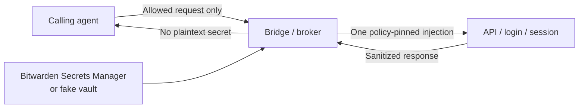

# Agent Credential Bridge

**Give an AI agent the *use* of a secret — never the secret itself.**

A fail-closed credential broker for coding agents. The agent asks to call an
allowed API, log into a form, or run a pinned SSH/FTP op. The Bridge injects
the credential at the outbound boundary. Passwords, tokens, cookies, and
session material stay in Bridge memory. If they leak onto an agent-readable
surface, tests fail.

> Experimental software. Not affiliated with, endorsed by, or supported by
> Bitwarden. Not a production password manager, and not a claim that
> same-user process isolation is a production writer boundary.

[Install on Windows](#install-on-windows) ·
[What you get](#what-you-get) ·
[For agents](#for-agents) ·
[Honest limits](#honest-limits)

---

## Why this exists

Agents are extraordinary at using tools and terrible at keeping secrets.
Paste an API key into chat once and it lives in logs, transcripts, screenshots,
and the next model's context window.

This project inverts that:

| The agent may | The agent never gets |
| --- | --- |
| Call a policy-pinned HTTP route | The bearer token, API key, or Basic password |
| Pick login fields by **index** | CSS/XPath, cookies, CDP, or the password value |
| Replay an opaque session on allow-listed paths | `Set-Cookie`, storage state, or `eval` |
| Exec a pinned SSH/FTP op on loopback | Process-environment injection (`env_inject`) |

The operator pastes a Bitwarden Secrets Manager **machine token** once, into a
local setup window. After that, agents work. Secrets do not.

## What you get

### Productive same-user path (Windows)

- **GitHub Release installer** with Start Menu setup, start, and Apps & Features
  uninstall.
- **Bitwarden Secrets Manager** as the default vault: machine account, project
  allowlist, DPAPI-backed token. Cloud by default; optional self-host URLs.
- **No extra Windows user** and **no LocalService required** for day-to-day SM
  resolve. Distinct-writer install remains optional research.
- Guided import of local DPAPI / `.env` material into SM (dry-run default).

### Credential classes that actually run

| Class | What the Bridge does |
| --- | --- |
| HTTP bearer / API-key header / Basic / query | Injects exactly one outbound credential; strips caller forgeries |
| Browser form-login | Logs in from memory; agent sees an opaque session, not the cookie |
| Bridge-owned browser | Agent is the *eyes* (field indices). Bridge is the *hands* for secrets. Optional in-process Playwright, never agent CDP |
| SSH / FTP (loopback) | Dedicated session brokers, allow-listed ops, no `env_inject` |

Unsupported on purpose, and they fail closed: OAuth, interactive MFA, SMS,
email codes, and process-environment injection.

### Security posture you can show a reviewer

- Policies are **allow-lists**, not template languages. Placeholders only —
  never values.
- Every runtime secret is scanned in raw, percent, form, Base64, and Base64url
  forms across responses, logs, and errors.
- One writer at a time. MFA/CAPTCHA terminate with value-free codes, not HTML.
- `authorization_ready` is evidence-driven. Unlocking SM does **not** set it
  true. The helper process stays vault-free.



## Install on Windows

1. Install [Node.js 20+](https://nodejs.org/) and the
   [Bitwarden Secrets Manager CLI (`bws`)](https://bitwarden.com/help/secrets-manager-cli/).
2. In Bitwarden SM: create a **machine account**, grant your projects, create an
   access token. Do not paste it into chat.
3. Download `BitwardenAgentCredentialBridge-Setup-*.exe` from GitHub Releases
   when a release exists, or clone this repo and run `npm run setup:sm:wizard`.
4. Start Menu → **Bitwarden Agent Bridge Setup** → paste the token locally.
5. Seed bindings, then start:

```powershell
npm run seed:sm -- --i-approve-secrets-manager-machine-write --prune --smoke --i-approve-secrets-manager-machine-resolve
npm run start:operational:sm -- --i-approve-secrets-manager-machine-resolve
```

Human walkthrough: [Windows laptop onboarding](docs/windows-laptop-onboarding.md) ·
[SM onboarding and import](docs/sm-onboarding-and-import.md)

Uninstall via **Apps & Features**, or `npm run uninstall:sm -- --i-approve-sm-machine-uninstall`.

macOS/Linux can use the same-user SM CLI path from source today; native
installers for those platforms are later slices.

## For agents

If you are an AI agent pointed at this repo, start here — not at the research
phase list:

1. [Install on Windows (agent runbook)](docs/agent-windows-install.md)
2. [SM onboarding and import](docs/sm-onboarding-and-import.md)
3. [Experiment rules](AGENTS.md)
4. [Bridge-owned browser contract](docs/phase17-bridge-owned-browser.md)
   (library + tests today; SM start command is the next slice)

Never echo tokens. Never set `BWS_ACCESS_TOKEN` in the user environment.
Never claim `authorization_ready=true` from SM setup alone. Missing `bws` is
`bws_missing`, not an authorization failure.

## Honest limits

- **Experimental.** Contracts are real; production isolation is not claimed.
- **Not affiliated with Bitwarden.** You bring your own SM machine account.
- **Loopback-first.** Public sites such as `traffic.mivia.ai` need a later
  explicit live gate. Agent Playwright-CLI, Chrome extensions, and agent CDP
  are not the secret path.
- **No cookie export.** If a task needs the cookie, use an HTTP broker or stop.
- **No MFA solving.** Challenge pages fail closed.
- Platform writer isolation (Windows LocalService, macOS LaunchDaemon, Linux
  systemd) is a documented research ladder, not a prerequisite for SM resolve.

Full capability map: [Features](docs/features.md).  
Phase-by-phase research index: [Research status](docs/research-status.md).

## Requirements

- Node.js 20+ (default tests are standard-library only — no npm runtime
  dependencies). Playwright is optional and **not** a package dependency.

```bash
npm test
node src/run-demo.js
```

`run-demo.js` generates a fake sentinel, drives the loopback broker, and exits
non-zero if that sentinel appears on any agent-readable surface.

## Contributing

- **Issues** — reproducible bugs and bounded work.
- **Discussions** — architecture and early ideas.
- **Pull requests** — tested, narrow, with a security-boundary note.
- **Private vulnerability reporting only** for suspected security issues.

See [CONTRIBUTING.md](CONTRIBUTING.md), [CODE_OF_CONDUCT.md](CODE_OF_CONDUCT.md),
[SUPPORT.md](SUPPORT.md), and [Architecture](docs/architecture.md).

## Funding

If this is useful, you can support maintenance on
[Buy Me a Coffee](https://buymeacoffee.com/shredfred).

## License

[Apache-2.0](LICENSE). This aligns with upstream Bitwarden Agent Access / OneCLI
licensing for research references only. This repository does not ship their
source, claim compatibility, or imply endorsement. See
[Licensing](docs/licensing.md).

Do not make this repository public until the
[public release checklist](docs/public-release-checklist.md) passes.
