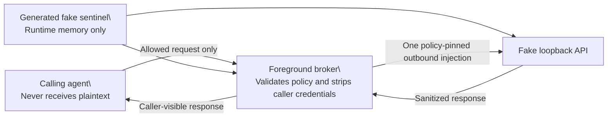

# Agent Credential Bridge

> A fail-closed security research harness for exploring how an AI agent can use
> a narrowly scoped credential without receiving its plaintext value.

**Experimental. Fake data only. Not a production credential manager.**

This project turns a deliberately small security question into testable
contracts: can a policy pin one outbound request while a broker injects a
runtime-only fake value and the caller never receives it? It does not access a
Bitwarden vault, deploy OneCLI, or use any real credential.

It is not affiliated with, endorsed by, or supported by Bitwarden or OneCLI.

## Start here

- Read [Architecture and repository boundaries](docs/architecture.md) to
  understand the public, private, and machine-local separation.
- Read [Development and releases](docs/development-and-releases.md) for the
  issue, pull request, discussion, and versioning workflow.
- Copy the later public GitHub description, topics, and feature settings from
  [GitHub launch settings](docs/github-launch-settings.md).
- Read [SECURITY.md](SECURITY.md) before reporting a potential vulnerability.
- Read the [public release checklist](docs/public-release-checklist.md) before
  changing repository visibility or publishing a release.

## Reference flow



The diagram describes the harness contract, not a production security
architecture. The generated sentinel is passed directly to the fake API and
broker in runtime memory; it is never stored in a policy, file, or general
process environment.

## What this repository is and is not

| It is | It is not |
| --- | --- |
| A fake-only research and regression harness | A production credential manager or vault integration |
| A set of narrow, fail-closed policy contracts | Permission to connect a real vault or account |
| A record of explicit platform-boundary evidence | A claim that same-user controls establish production isolation |
| A public codebase for synthetic tests and reproducible docs | A place for credentials, vault references, private inventories, or raw host output |

## Research status

The repository currently contains fake loopback contracts for bearer, API-key
header, HTTP Basic, API-key query, and disposable/dev `browser_form_login` (form
+ session replay without exposing plaintext to the agent); offline OneCLI and
Agent Access readiness evidence; and approval-gated, disposable platform-boundary
research. None of these slices are a production password manager or an
authorization to use a personal/company Bitwarden vault. OAuth, interactive MFA,
SMS/email codes, SSH/FTP, and process-env injection remain permanently rejected.
Day-to-day disposable/dev multi-service use is available via
`npm run start:operational` (`harness_ready`); `authorization_ready` is wired
through Phase 9e → Phase 9a and stays false unless complete branded production
evidence is supplied
(see [docs/phase9e-windows-operational-authorization.md](docs/phase9e-windows-operational-authorization.md)).

---

Sample-only security experiment. Phase 1 tests a **credential-bridge contract**.
Phase 2 adds an offline, non-mutating OneCLI readiness audit. Phase 3 adds
offline supply-chain evidence and a not-run disposable live-test design. Phase
4a adds a fake-only, policy-pinned HTTP API-key header contract. Phase 4b adds
a fake-only HTTP Basic contract. Phase 4c adds a local OneCLI chained-proxy
token-placement contract with fake gateway tests. Phase 5a adds a pure cross-platform bootstrap
plan. None of these phases access a real vault or test Bitwarden product
security or OneCLI production security.

## What Phase 1 covers

| Piece | Role |
| --- | --- |
| Fake HTTP API | Local loopback server that accepts one runtime-generated bearer sentinel and returns a constant JSON body |
| Sample policy | Declarative allow-list with bind URL, upstream URL, method, path, and `authorization: "{{credential}}"` |
| Policy validation | Rejects non-loopback URLs, literal credentials, unsupported placeholders, and unsupported credential classes (fail closed) |
| Foreground HTTP broker | Binds to loopback (ephemeral port allowed), strips caller `Authorization`, injects the sentinel only on the outbound request, returns a sanitized response |
| Tests | Functional coverage plus exposure checks (broker logs, stdout/stderr, worktree file scan) that fail if the runtime sentinel appears on agent-readable surfaces |

## What Phase 1 does **not** cover

Bitwarden pairing, OneCLI deployment, TLS interception, certificate installation, firewall mutation, background services, browser login, MFA, SSH, databases, RDP, or desktop credential handling.

Do not connect this harness to a personal or company Bitwarden vault.

## What Phase 4a covers

- A strict version-2 `http_api_key_header` policy with exactly one lowercase
  ASCII header name of at most 128 characters and an exact `{{credential}}`
  value placeholder.
- Broker-start revalidation, case-insensitive caller credential/protocol-header
  stripping, and exactly one outbound policy-pinned API-key header.
- Rejection of query/fragment-like request targets and upstream redirects.
- A 1 MiB (`MAX_UPSTREAM_RESPONSE_BODY_BYTES`) upstream response limit, matching
  the request limit. Valid `Content-Length` values are checked before reading;
  streamed chunks are counted again before the complete buffer is scanned.
- Functional and exposure tests for spoofed/duplicate headers, split response
  chunks, decoded response headers, oversized responses, and raw or encoded
  runtime sentinel non-disclosure.

Phase 4a remains local, fake-only, foreground-only, and Node standard-library
only. Version-1 `http_bearer` policies remain compatible. Browser and website
passwords, Basic Auth, query/cookie/form injection, process-environment
injection, SSH, databases, and desktop credentials remain unsupported.

See [`docs/phase4a-http-api-key.md`](docs/phase4a-http-api-key.md).

## What Phase 4b covers

- A strict version-3 `http_basic` policy with separate exact `{{username}}`
  and `{{password}}` placeholders and an exact in-memory runtime object
  containing only `username` and `password`.
- Printable ASCII credentials with explicit length bounds. Usernames cannot
  contain `:`, while passwords may contain it.
- Case-insensitive stripping of caller authentication headers followed by one
  standard, padded `Authorization: Basic ...` value on the upstream request.
- Response-body, response-header-name/value, log, and error scanning for raw,
  percent-encoded, Base64, and Base64url credential forms.

Phase 4b remains loopback-only, foreground-only, dependency-free, and fake-only.
It does not retrieve credentials from Bitwarden, operate a browser, or provide
a production authentication proxy. See
[`docs/phase4b-http-basic.md`](docs/phase4b-http-basic.md).

## What Phase 4c covers

- A strict version-4 `onecli_proxy` policy pinning one loopback OneCLI gateway
  and one lowercase DNS destination on port 443.
- A foreground chained proxy that accepts HTTP absolute-form and HTTPS
  `CONNECT`, strips caller proxy/auth material, and sends exactly one generated
  OneCLI `Proxy-Authorization` value only to the gateway leg.
- Bounded headers, bodies, handshakes, idle time, connections, and tunnel bytes,
  plus fake-gateway functional and agent-token exposure tests.
- A fixed-entrypoint same-user supervisor that transfers token/policy over
  inherited IPC only, owns the parent lease, validates one loopback ready
  record, invalidates dead children, and performs bounded shutdown.
- An explicit HTTPS limitation: after CONNECT, this bridge sees opaque bytes
  and can enforce destination authority only, not method/path/content policy.

Phase 4c does not start OneCLI, pair Bitwarden, install a gateway CA, provide a
signed package identity, or handle target credentials. See
[`docs/phase4c-onecli-chained-proxy.md`](docs/phase4c-onecli-chained-proxy.md).

## What Phase 2 covers

- An upstream lock for OneCLI release `1.45.0`, its reviewed source commit, and
  the crates.io `ap-client` `0.9.0` dependency actually linked by OneCLI.
- Pure proposed-configuration validators for audited local binds, pinned images,
  deployment values, relay transport, the source-fixed cache TTL, and runtime
  separation.
- An injected-runner preflight that checks platform, Docker CLI, Compose,
  `aac`, and the audited local ports (dashboard `10254`, gateway `10255`,
  Postgres `5432`) using read-only commands.
- A placeholder-only, deliberately non-deployable sample configuration.
- Readiness limits and threat boundaries in
  [`docs/phase2-onecli-readiness.md`](docs/phase2-onecli-readiness.md).

Phase 2 does not start or stop Docker, pull images, access a network or relay,
pair a vault, read environment values, create tokens, or read/write real
secrets. Those operations require a separate live-test gate.

For the pinned baseline, the audited Bitwarden provider hard-codes
`credentialCacheTtlSeconds` to `60`; this is source behavior, not a Compose
setting.

## What Phase 3 covers

- An offline evidence lock for the supplied OneCLI and Postgres OCI index and
  Linux platform-manifest digests.
- An explicit distinction between OneCLI's linked crates.io `ap-client`
  `0.9.0`, candidate AAC `0.11.0`, and the later Agent Access workspace
  `0.12.0` source-audit reference.
- Pure validators for canonical SHA-256 values, three-part versions, exact
  platform-manifest selection, and the candidate's required `unverified`
  compatibility status.
- A deliberately non-deployable Compose example: digest placeholders only,
  internal-only Postgres, no host-published dashboard, and a loopback-only
  gateway.
- A gated disposable live-test runbook covering artifact checks, isolation,
  non-disclosure, denial tests, cache/revocation behavior, cleanup, and
  redacted evidence.

Phase 3 artifacts have not been deployed or paired. Candidate AAC `0.11.0`
compatibility with OneCLI `1.45.0` remains **unverified** until the separately
approved disposable test passes and its evidence is reviewed. See
[`docs/phase3-disposable-live-test.md`](docs/phase3-disposable-live-test.md).

## Requirements

- Node.js 20+ (ESM, standard library only — no npm dependencies)

## Quick start

```bash
npm test
npm run test:phase4a
npm run test:phase4b
npm run test:phase4c
npm run test:phase5a
npm run test:phase5b
npm run test:phase5c
npm run test:phase5d
npm run test:phase5e
npm run test:phase5f
npm run test:phase5g
npm run test:phase3
npm run test:phase5h4
npm run test:phase5h5
npm run test:phase5h6
npm run test:phase5h7
npm run test:phase5h8
npm run test:phase5h9
npm run test:phase5h10
npm run test:phase5h18
npm run test:phase5h19
npm run test:phase5h20
npm run test:phase5h21
node src/run-demo.js
```

For the latest macOS verification evidence and the exact Windows/Cursor
continuation checklist, see
[`docs/macos-validation-and-windows-handoff.md`](docs/macos-validation-and-windows-handoff.md).

`run-demo.js` generates a cryptographically random fake sentinel, starts the fake API and foreground broker, calls through the broker bind URL, and prints only caller-visible status/body. It exits non-zero if the sentinel leaks into those surfaces or broker logs.

To perform only the optional local Phase 2 readiness inspection:

```bash
npm run preflight:onecli
```

The preflight prints JSON and exits non-zero when a prerequisite is missing, a
required port is occupied, or a probe cannot establish readiness. It does not
print command output or environment values. A pass is not permission to deploy
or pair OneCLI.

To inspect the derived per-user bridge layout without reading configuration
contents or changing the machine:

```bash
npm run preflight:bootstrap
```

The command emits only fixed check IDs/status/reasons and exits non-zero when
the bridge has not been installed securely. A pass is not authorization to
install, pair Bitwarden, or access a vault.

## Contract under test

1. The **caller** (stand-in for an agent) never receives the sentinel or its percent-encoded, Base64, or Base64url forms in the HTTP response body, sanitized headers, broker logs, stdout/stderr, `process.env`, or tracked worktree files.
2. For version 1, the **broker** strips caller credential/protocol headers and injects `Authorization: Bearer <runtime-sentinel>` only on the outbound upstream request.
3. For version 2, the broker strips the pinned API-key header and caller credential/protocol headers case-insensitively, then injects exactly one pinned header whose value is the runtime sentinel.
4. Version-1 `authorization` and version-2 `header_value` must be exactly `{{credential}}`. Literal credential values, unsupported placeholders, extra fields, unsafe API-key header names, and API-key header names longer than 128 ASCII characters are rejected.
5. Version 3 requires separate exact `{{username}}` and `{{password}}` policy placeholders and an exact runtime `{ username, password }` object. The broker injects exactly one HTTP Basic authorization value.
6. Requests with query or fragment-like syntax are rejected. Upstream redirects fail closed, and upstream bodies larger than 1 MiB produce a generic `502` before any partial body is forwarded.
7. **Bind** and **upstream** must be `http` loopback only (`127.0.0.1` or `localhost`) with an explicit port (`0` allowed for ephemeral bind).
8. **Unsupported credential classes** fail closed at validation and again at broker start. There is no fallback to printing secrets or injecting them into the general process environment.

## Runtime sentinel

No bearer token or API key is hard-coded in tracked source. Each demo/test
process calls `generateFakeSentinel()` (cryptographically random) and passes
that value explicitly into the fake API and broker. It is never stored in a
policy, file, or environment variable. Appearance of that runtime value on an
agent-readable surface is a hard test failure.

## Sample policy shape

```json
{
  "version": 1,
  "service": "fake-sample-api",
  "credential_class": "http_bearer",
  "bind": "http://127.0.0.1:0",
  "upstream": "http://127.0.0.1:0",
  "method": "GET",
  "path": "/v1/resource",
  "authorization": "{{credential}}"
}
```

Demo/tests rewrite `upstream` to the fake API’s concrete loopback origin after it binds.

The version-2 sample is equally strict:

```json
{
  "version": 2,
  "service": "fake-sample-api",
  "credential_class": "http_api_key_header",
  "bind": "http://127.0.0.1:0",
  "upstream": "http://127.0.0.1:0",
  "method": "GET",
  "path": "/v1/resource",
  "header_name": "x-fake-api-key",
  "header_value": "{{credential}}"
}
```

## Layout

```
policies/sample-fake-service.json   declarative sample policy
policies/sample-fake-api-key-service.json
                                      strict version-2 API-key sample
policies/sample-fake-basic-service.json
                                      strict version-3 HTTP Basic sample
upstream/onecli.lock.json            corrected Phase 2 upstream revisions
upstream/supply-chain.lock.json      Phase 3 offline digest/revision evidence
samples/onecli/secure-local.example.json
                                      rejected deployment placeholders
deploy/compose.disposable.example.yaml
                                      non-deployable bounded template
src/constants.js                    constant API body + sentinel generator
src/policy.js                       load + validate (loopback + placeholder rules)
src/fake-api.js                     local fake HTTP API
src/broker.js                       foreground loopback HTTP broker
src/run-fake-api.js                 foreground API process
src/run-demo.js                     end-to-end foreground demo
src/onecli-audit.mjs                pure proposed-config validators
src/supply-chain-audit.mjs          pure Phase 3 evidence validators
scripts/preflight-onecli.mjs        read-only, value-free readiness report
docs/phase2-onecli-readiness.md     evidence, platform path, threat boundaries
docs/phase3-disposable-live-test.md approval-gated, not-run live-test plan
docs/phase4a-http-api-key.md         fake-only version-2 contract and limits
docs/phase4b-http-basic.md           fake-only version-3 contract and limits
docs/phase5a-portable-bootstrap-plan.md
                                      pure cross-platform machine/repo boundary
docs/phase5b-read-only-host-preflight.md
                                      value-free metadata and integrity audit
docs/phase5c-windows-security-adapter.md
                                      bounded read-only Windows ACL probe
docs/phase5d-apply-live-test-gate.md   explicit mutation and disposable-test gate
docs/phase5e-disposable-workspace.md   marked OS-temp-only execution boundary
docs/phase5f-disposable-permissions.md OS-specific hardening inside marked roots
docs/phase5g-disposable-executor.md    real install/upgrade/rollback in temp only
docs/phase5h-helper-protocol.md         pure separate-writer helper wire contract
docs/phase5h2-windows-helper-evidence.md pure Windows token/ACL evidence compiler
docs/phase5h3-linux-helper-evidence.md   pure Linux host-UID/peercred evidence compiler
docs/phase5h4-macos-helper-evidence.md   pure macOS Mach/audit-token evidence compiler
docs/phase5h5-inherited-launcher-transfer.md real disposable inherited-handle check
docs/phase5h6-windows-helper-pipe-session.md real local pipe/token denial check
docs/phase5h7-windows-native-denial-session.md combined pipe/handle/AccessCheck denial
docs/phase5h8-windows-passwordless-service-plan.md pure passwordless service contract
docs/phase5h9-windows-service-boundary-preflight.md native read-only service check
docs/phase5h10-native-windows-service-host.md deterministic native lifecycle scaffold
docs/phase5h11-native-pipe-denial.md native local pipe/token denial probe
docs/phase5h12-explicit-pipe-dacl.md fixed protected native pipe DACL proof
docs/phase5h13-server-identity-verifier.md pre-request SCM/PID/token verifier
docs/phase5h14-denial-only-service-loop.md ServiceMain denial pipe activation
docs/phase5h15-windows-service-lifecycle-gate.md pure disposable elevated gate
docs/phase5h16-windows-service-lifecycle-evidence.md value-free transcript machine
docs/phase5h17-linux-systemd-boundary-plan.md pure fixed systemd system-service contract
docs/phase5h18-macos-launchd-boundary-plan.md pure fixed launchd system-helper contract
docs/phase5h19-macos-launchd-boundary-preflight.md read-only fixed macOS host inspection
docs/phase5h20-macos-code-snapshot-verification.md fd-content-bound Apple code verification
docs/phase5h21-macos-mach-denial-session.md real same-EUID Mach audit-trailer denial
docs/phase5h22-macos-launchd-lifecycle-gate.md pure distinct-EUID lifecycle gate
docs/phase5h23-macos-launchd-lifecycle-evidence.md value-free lifecycle transcript grammar
docs/phase5h24-native-macos-launchd-helper.md compiled denial-only launchd helper scaffold
docs/phase5h25-signed-macos-lifecycle-package.md real signed helper/plist bindings, non-installing
docs/phase5h26-macos-lifecycle-read-only-dry-run.md no-input read-only lifecycle preflight
docs/phase5h27-macos-retained-file-ownership.md native retained-FD publication/cleanup core
docs/phase5h28-macos-account-soft-ownership.md native full-tuple account ownership core
docs/phase5h29-macos-launchd-job-soft-ownership.md native full-identity launchd ownership core
docs/phase5h30-macos-composite-lifecycle-controller.md cross-layer native finally-cleanup controller
docs/phase5h44-windows-lifecycle-collector-trust.md pure elevated-collector provenance trust
docs/phase5h45-windows-service-lifecycle-live.md disposable elevated install/deny live matrix
docs/phase5h46-windows-service-install-gate.md install-gate evidence compiler
docs/phase5h47-windows-helper-layout-plan.md ProgramData-class helper layout contract
docs/phase5h48-windows-service-authorize-schema.md deny-only authorize schema
docs/phase5h49-windows-helper-disposable-apply.md disposable apply envelope/simulation
docs/phase5h50-windows-persistent-service-lifecycle.md persistent install/uninstall plan
docs/phase5h51-fake-vault-resolver.md fake alias to broker secrets
docs/phase5h52-dev-bitwarden-resolver.md gated DPAPI/dev Bitwarden resolver
docs/phase5h53-54-localservice-apply.md retained-handle cleanup + LocalService apply
test/*.test.js                      functional + exposure tests
AGENTS.md                           experiment rules for agents
```

## Limitations

- Fake HTTP credential classes (`http_bearer`, `http_api_key_header`,
  `http_basic`, `http_api_key_query`) plus disposable/dev `browser_form_login`
  (policy v5) for loopback form login via a dedicated session broker (not
  `startBroker`).
- Browser sessions use stdlib fetch + cookie jar; Playwright is not default.
  Secrets and session cookies must not appear on agent-readable surfaces.
  MFA/CAPTCHA/login failure are fail-closed and value-free.
- Sample policy uses port `0` for bind/upstream placeholders; runtime code supplies the concrete upstream origin after the fake API listens.
- No TLS for the fake harness bind path, no persistence, no multi-writer coordination beyond “one writer at a time” for this repo.
- Not a personal/company Bitwarden password manager; `authorization_ready` stays false.
- See [docs/phase6-browser-form-login.md](docs/phase6-browser-form-login.md) and
  [docs/phase7-hq-operational-readiness.md](docs/phase7-hq-operational-readiness.md).
- The disposable executor does not isolate against a malicious concurrent process
  running as the same OS user; production use requires a separate identity or
  equivalent sandbox. Phase 5h.1 defines its fail-closed wire contract, but the
  OS-specific identity boundary is not implemented yet.
- Phase 5h.2 refuses to treat Windows Restricted Tokens or AppContainers as a
  distinct writer when their `TokenUser` SID remains the caller's SID.
- Phase 5h.3 similarly refuses to treat namespace-local UID 0, seccomp, Landlock,
  capabilities, or no-new-privs as a distinct Linux host principal.
- Phase 5h.4 refuses to treat App Sandbox, Hardened Runtime, signing identity,
  or a different audit session as a distinct macOS writer when the effective
  UID remains equal.
- Phase 5h.5 proves only that a short-lived child can independently verify
  launcher bytes received through an inherited read-only handle. It does not
  establish a distinct writer or authenticated local IPC.
- Phase 5h.6 uses a real Windows named pipe with remote clients rejected and
  live process-token inspection, but deliberately proves only that the current
  same-user helper is rejected.
- Phase 5h.7 additionally carries the canonical request over that pipe, verifies
  an inherited launcher handle inside the probe, and performs native AccessCheck
  calls for every first-install target. It still cannot authorize the same user.
- Phase 5h.8 fixes the future Windows writer to a passwordless `LocalService`
  service SID and a digest-pinned binary, but performs no service installation,
  elevation, ACL mutation, or host inspection.
- Phase 5h.9 performs a real, value-free read-only inspection of that fixed
  service and its binary/security boundary. The expected current result is not
  present because the service has not been installed. Even a matching path-based
  snapshot remains advisory and cannot authorize an apply.
- Phase 5h.10 builds a same-source, pinned-toolchain reproducible native Windows
  service lifecycle executable without application `PackageReference` dependencies,
  entirely in disposable roots. It deliberately has no IPC listener or manifest
  executor, does not claim a live-verified SCM
  lifecycle, and is not eligible for installation.
- Phase 5h.11 adds a console-only native named-pipe proof with remote rejection,
  first-instance enforcement, live client PID/token binding, and explicit
  same-`TokenUser` denial. The service entrypoint still does not activate IPC,
  has no service-specific pipe DACL, and remains ineligible for installation.
- Phase 5h.12 replaces the ambient pipe DACL with an exact protected three-ACE
  descriptor and verifies the created kernel object's DACL before accepting a
  client. Service-mode IPC and installation remain disabled.
- Phase 5h.13 binds the connected server PID to the fixed running SCM service,
  LocalService `TokenUser`, and enabled service-SID group before any request.
  The current console server is correctly rejected and sends no request.
- Phase 5h.14 compiles the denial-only listener into `ServiceMain`, gated on
  LocalService plus the enabled fixed service SID before Running and before each
  pipe instance. It accepts only canonical non-secret nonce frames, requires a
  different client `TokenUser`, and always denies with incomplete target-ACL
  evidence and no manifest executor. Neither SCM lifecycle nor service-mode pipe
  activation has been live-verified, so installation remains ineligible.
- Phase 5h.15 freezes the exact disposable Windows stage/install/start/verify/
  deny/stop/delete/cleanup lifecycle as a pure approval envelope. It accepts no
  approval value, emits no commands or host identifiers, performs no mutation,
  and keeps installation ineligible until the named elevated test is explicitly
  approved in the active task.
- Phase 5h.16 validates the future collector's value-free lifecycle transcript as
  a strict state machine: canonical preflight/mutation/denial/cleanup order,
  ownership-consistent skip semantics, and final absence proof. Even a complete
  synthetic transcript remains explicitly untrusted, not live-verified, and not
  authorization evidence.
- Phase 5h.17 starts Linux parity with a pure plan limited to the systemd system
  manager, a fixed static non-login service account, fixed service/socket units,
  root-owned nonwritable artifacts, a filesystem AF_UNIX endpoint, and explicit
  sandbox requirements. It performs no host inspection, elevation, account/unit
  creation, socket I/O, or mutation and remains ineligible for installation.
- Phase 5h.18 fixes the future macOS writer to the launchd system domain, a
  static hidden non-login helper account, a fixed Mach service, and pinned
  binary/designated-requirement digests. It also requires the accepted Mach request
  audit token to match the authorizing caller. It performs no host inspection,
  signing, launchd/Mach I/O, elevation, account/daemon creation, Keychain access,
  or mutation and remains ineligible for installation.
- Phase 5h.19 performs a real read-only inspection of the fixed macOS helper
  artifacts, account, binary digest, and designated code requirement while
  returning booleans only. The current expected result is the canonical absent
  snapshot. Its path-based codesign comparison is reported separately and, by
  itself, cannot establish verified code or an aggregate match. The result is
  non-authorizing and ineligible for installation or Mach-service use.
- Phase 5h.20 binds Apple signature and designated-requirement verification to
  an exclusive byte-identical private snapshot copied from the already-open
  helper descriptor. A matching static snapshot can now be represented, while
  authorization remains forced false until a live launchd/Mach identity collector
  exists. The only write is the private temporary measurement file plus mandatory
  exact cleanup; it never touches `/Library`, user home, Keychain, or Bitwarden.
- Phase 5h.21 runs a real cross-process raw-Mach nonce exchange and binds both
  request and reply senders through kernel `MACH_RCV_TRAILER_AUDIT` tokens,
  including PID generations and EUID digests. It honestly reports a same-EUID
  denial, never claims the production launchd service or code requirement, sends
  no manifest request, and remains ineligible for installation or authorization.
- Phase 5h.22 freezes the future explicitly approved distinct-EUID LaunchDaemon
  denial lifecycle as a pure branded gate. It binds the reviewed binary, plist,
  and designated-requirement values; encodes collision-safe soft ownership and
  ordered cleanup; accepts no approval or host-selected values; performs no
  mutation; and keeps installation and authorization ineligible.
- Phase 5h.23 validates only the structure of a future value-free lifecycle
  transcript. It derives soft account/job and retained-FD file ownership,
  distinguishes proven no-effect from ambiguous mutation failures, enforces
  ownership-consistent cleanup and final absence, supports an untrusted
  pre-mutation-only `dry_run_complete` outcome, and still returns no trusted,
  live, authorizing, or installation-eligible evidence.
- Phase 5h.24 compiles the real no-argument launchd/MachServices denial-only
  entrypoint. It verifies the fixed non-login account before check-in, accepts
  only one bounded audit-trailer nonce probe, and can only reply denied. Its
  runner performs two source-snapshot-bound private-temp builds, fixed self-test,
  ambient no-arg rejection, and exact cleanup; nothing is installed or trusted.
- Phase 5h.25 produces the real local signed helper/plist package entirely in
  private temporary roots. It verifies same-host reproducibility, exact ad-hoc
  designated requirement, FD-content code identity, and plist rules; it binds
  the resulting digests into branded plans/gates without installation while
  keeping all mutation and authorization flags false.
- Phase 5h.26 runs the complete seven-step pre-mutation lifecycle dry run on
  macOS. It emits only bounded value-free facts, uses a non-activating system
  launchd-domain snapshot for Mach-name absence, performs no system mutation,
  and remains explicitly untrusted and ineligible for installation.
- Phase 5h.27 implements and fixture-tests the native retained-FD ownership core
  needed for system binary/plist publication and cleanup. Exclusive collisions
  are preserved, and a replaced path is never adopted or deleted.
- Phase 5h.28 implements and fault-tests full-tuple macOS account ownership.
  Name, UniqueID, GeneratedUID, shell, and home must survive immediate and
  pre-delete re-verification; identity drift can never authorize deletion.
- Phase 5h.29 implements full-identity launchd job ownership, process-bound
  denial gating, and ordered stop/bootout/absence cleanup. Ambiguous activation
  is cleaned, while foreign job replacement is preserved.
- Phase 5h.30 composes file, account, and launchd ownership into the exact
  preflight→mutation→denial→reverse-finally lifecycle. Cross-layer faults prove
  cleanup continuation and preservation of replaced foreign objects.
- Phase 5h.31 provides the shell-free, fixed-environment native command runner
  needed by future macOS system adapters. It closes inherited descriptors,
  bounds output and time, and always kills/reaps failed or runaway children;
  tests use harmless system commands only and perform no privileged mutation.
- Phase 5h.32 adds the exact `_bwagentbridge` `dscl` adapter over that runner.
  It strictly parses directory results, treats partial creation as ambiguous,
  and rebinds the full live identity immediately before deletion. Its tests use
  only a fake runner and do not modify the host directory service.
- Phase 5h.33 adds fixed system-domain `launchctl` operations with unique-key
  parsing, digest/policy revalidation, and separate mandatory Mach presence and
  denial probes. Mutation tests remain fake-only; a read-only Apple-job print
  confirms the current host output grammar without touching the bridge job.
- Phase 5h.34 wires the native adapters into the controller and binds every job
  mutation to retained binary/plist identities. Production wiring accepts only
  the exact two `/Library` parent directories; a compile-time-only test
  constructor exercises clean and replacement-fault lifecycles in private temp.
- Phase 5h.35 implements the production Mach denial client. A freshly parsed
  launchctl PID is bound to the reply's kernel audit trailer, while before/after
  process snapshots preserve EUID, start time, and exact helper path. Private
  Mach tests prove valid denial and reject a wrong PID without using the fixed
  production service.
- Phase 5h.36 adds the non-activating Mach-name presence collector. It streams a
  bounded `launchctl print system`, matches only the exact endpoint-entry line,
  rejects path/name substrings, and shares the hardened executable validator.
  The live read-only result on this Mac is fixed-name absent.
- Phase 5h.44 compiles branded gate + structurally complete transcript + exact
  injected collector provenance into `collector_trust_verified` without treating
  UAC/admin/high-integrity alone as trust. Even a complete provenance schema stays
  unlive, mutation-unauthorized, install-ineligible, and non-authorizing until a
  later operator-approved elevated disposable collector runs.
- Phase 5h.45 runs that disposable elevated LocalService install/start/deny/stop/
  delete matrix under explicit operator approval, may set `live_test_verified`
  after cleanup/absence proof, and still keeps production install authorization
  false. It does not read Bitwarden or DPAPI vault credentials.
- Phase 5h.46–5h.54 continue the Windows finish line: install-gate evidence,
  ProgramData layout, authorize schema, disposable LocalService first-install
  apply over the denial pipe (narrow-rights native client), persistent
  install/uninstall under ProgramData, fake vault→broker wiring, and a gated
  DPAPI/dev-Bitwarden resolver that keeps the helper vault-free. Live disposable
  denial can set collector trust and install-gate eligibility; persistent
  `authorization_ready` remains false until handle-bound production evidence
  exists. Run `npm run live:windows-persistent -- install|uninstall` only under
  operator approval (UAC); leave the machine clean after uninstall.
- Phase 9a adds the pure Windows production authorization compiler that may
  return `authorization_ready=true` only for complete branded handle-bound
  identity + target-ACL + peer five-fact evidence on a persistent ProgramData
  layout after install-gate eligibility.
  See [docs/phase9-windows-authorization-ready.md](docs/phase9-windows-authorization-ready.md).
- Phase 9b collects handle-bound installed-service identity (native 5h.13 pipe/
  SCM/token verifier + handle-open binary digest/ACL probe). Public reports keep
  `authorization_ready=false`. A complete positive collection still requires a
  separately installed running LocalService; see
  [docs/phase9b-windows-handle-bound-identity.md](docs/phase9b-windows-handle-bound-identity.md).
- Phase 9c collects the AccessCheck matrix for the five fixed ProgramData helper
  targets (caller denied / helper allowed / trusted ownership / no reparse).
  Public reports keep `authorization_ready=false`; see
  [docs/phase9c-windows-target-acl-matrix.md](docs/phase9c-windows-target-acl-matrix.md).
- Phase 9d collects a different-principal persistent pipe session into branded
  Phase 5h.1 peer five-facts. Same-user console hosts remain non-authorizing;
  see [docs/phase9d-windows-persistent-peer-session.md](docs/phase9d-windows-persistent-peer-session.md).
- Phase 9e wires operational readiness to the branded Phase 9a report. Default
  incomplete evidence stays false; see
  [docs/phase9e-windows-operational-authorization.md](docs/phase9e-windows-operational-authorization.md).
- Phase 9f package-binds reviewed helper source/toolchain/entrypoint digests and
  the OneCLI proxy supervisor entrypoint/imports for collector publish paths;
  see [docs/phase9f-windows-helper-package-binding.md](docs/phase9f-windows-helper-package-binding.md).
- Phase 10a adds a foreground Day-2 evidence refresh loop for an already-installed
  LocalService (`npm run live:windows-authorization-refresh`); see
  [docs/phase10a-windows-authorization-evidence-refresh.md](docs/phase10a-windows-authorization-evidence-refresh.md).
- Phase 10b adds the operator bootstrap that may exit with
  `authorization_ready=true` only from branded compose
  (`npm run live:windows-authorization-ready`); see
  [docs/phase10b-windows-authorization-ready-bootstrap.md](docs/phase10b-windows-authorization-ready-bootstrap.md).
- Phase 10c unifies bootstrap + operational bridge + refresh into one Day-2
  operator session (`npm run live:windows-day2-operator`); see
  [docs/phase10c-windows-day2-operator.md](docs/phase10c-windows-day2-operator.md).
- No browser/website automation, query, cookie, form, process-env,
  SSH, database, RDP, or desktop credential injection.
- Not a substitute for vault, OS keychain, or production broker hardening.
- Phase 2 validates a proposal and local prerequisites only. It does not verify
  remote tags, images, relay reachability, Docker permissions, or runtime
  isolation.
- Phase 3 records supplied evidence but performs no network verification,
  download, install, image pull, deployment, pairing, or live compatibility
  test.

## Contributing and community

Public collaboration is deliberately separated by purpose:

- **Issues** are for reproducible bugs and bounded, agreed work.
- **Pull requests** are for tested changes with a documented security-boundary
  review.
- **Discussions** are for architecture, Q&A, and early research ideas.
- **Private vulnerability reporting** is the only route for suspected security
  problems. Never disclose those in a public issue, pull request, or discussion.

See [CONTRIBUTING.md](CONTRIBUTING.md), [CODE_OF_CONDUCT.md](CODE_OF_CONDUCT.md),
and [SUPPORT.md](SUPPORT.md) for the working agreement.

## Funding

If this research project is useful, you can support its maintenance through
[Buy Me a Coffee](https://buymeacoffee.com/shredfred). GitHub will display the
Sponsor button when this repository becomes public.

## License and upstream references

Agent Credential Bridge is licensed under [Apache-2.0](LICENSE). This aligns
with the Apache-2.0 licensing of the upstream Bitwarden Agent Access and OneCLI
projects, which this repository references for research evidence only. It does
not ship their source code, claim compatibility, or imply an endorsement. See
[Licensing and upstream use](docs/licensing.md).

## Public-release gate

Do not make this repository public, create a public release, or push a release
tag until an independent secret scan and publication review pass succeeds. The
full gate also requires an explicit license decision, GitHub security settings,
maintainer-owned reporting/funding channels, and a tested release process. See
the [public release checklist](docs/public-release-checklist.md).
