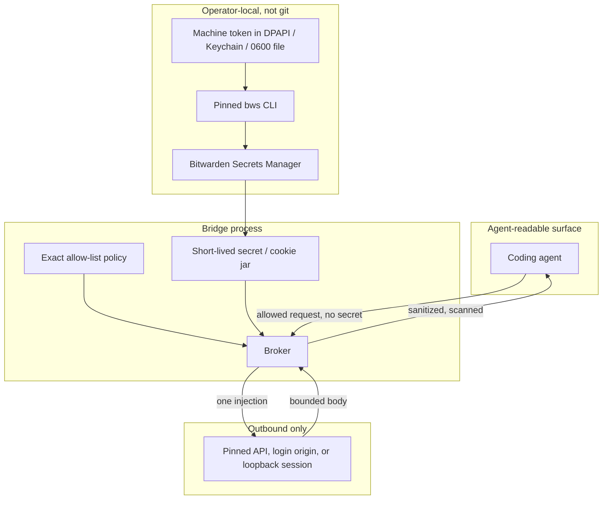

# How it works (and how that relates to Agent Access)

This note is for a reader who has seen the
[Bitwarden Agent Access](https://github.com/bitwarden/agent-access) SDK or the
[Agent Access announcement](https://bitwarden.com/blog/introducing-agent-access-sdk/)
and wants the mapping to this repository. It is not a Bitwarden document.

## The shared problem

Both projects start from the same observation: if you paste a vault secret into
an agent transcript, it is no longer a secret. Logs, screenshots, tool traces,
and the next prompt all see it.

Agent Access builds an **open protocol**: a remote client, a Noise tunnel, a
pairing token, a local listener (`aac listen`) bound to a credential provider
(often the Bitwarden CLI), and optional `aac run` to inject fields into a
**child process environment**.

This Bridge is a **fail-closed broker** for coding agents on the operator's
machine. It resolves from **Bitwarden Secrets Manager** (machine account),
keeps material in broker memory, and injects **once** at a policy-pinned
outbound boundary (HTTP, browser session, loopback SSH/FTP). It never returns
the secret to the agent, and it **rejects** process-environment injection.

## Topology

## Step by step

1. **Operator setup (once).** Create an SM machine account, grant projects,
   paste the access token into the local wizard. The token lands in the OS
   store. It must not appear in chat, git, or `BWS_ACCESS_TOKEN` on an
   agent-visible environment.
2. **Bind aliases.** A tracked, secret-free table maps aliases to policy files
   and credential classes. Policies contain `{{credential}}` / `{{username}}` /
   `{{password}}` placeholders only.
3. **Agent call.** The agent asks for an allow-listed HTTP path, browser op, or
   session op. It does not pass the secret.
4. **Resolve into memory.** The Bridge runs `bws` as a short-lived child with
   the token supplied out of band, then holds the value in process memory.
5. **Inject outbound.** The broker strips caller credential headers, injects
   exactly one value, and fetches or drives the session.
6. **Sanitize inbound.** Responses, logs, and errors are scanned for the raw
   secret and its percent, form, Base64, and Base64url forms. A hit becomes a
   generic failure. Tests fail if a fake sentinel appears on an agent-readable
   surface.

## Mapping to Agent Access

| Agent Access SDK idea | This Bridge |
| --- | --- |
| Remote agent over a Noise tunnel | Same-user local broker; the coding agent is a local caller |
| Pairing token + `aac listen` / `aac connect` | SM machine token in an OS store + operator CLI flags |
| Human approve each vault item | Project allowlist + exact policy; no per-request GUI yet |
| Bitwarden CLI (`bw`) password-manager provider | Secrets Manager CLI (`bws`) machine account |
| `aac run` injects `AAC_*` into a child environment | **Forbidden.** Class `env_inject` is permanently rejected |
| Return username/password JSON to the client | **Forbidden.** The agent never receives plaintext |
| Helper / provider holds vault access | OS helper research stays **vault-free**; resolve stays in the Bridge process |
| Early preview, APIs change | Experimental 0.x; same honesty |

Agent Access is the right design if you need a **distinct remote** to request a
credential through an encrypted tunnel and a human-in-the-loop provider.
This Bridge is the right design if a **coding agent on your laptop** must call
an API, submit a loopback login, or run a pinned session op **without** the
secret entering the model context.

They are complementary research directions, not drop-in replacements. This
repository does not ship Agent Access source, claim protocol compatibility, or
use Bitwarden marks.

## What still fails closed

OAuth, interactive MFA, SMS, email codes, non-loopback SSH/FTP without a later
live gate, cookie export, agent CDP, and `authorization_ready=true` from SM
unlock alone.

Full feature map: [Features](features.md).
Platform writer ladders: [Research status](research-status.md).
